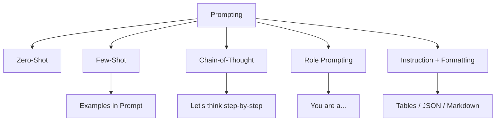

# 📘 Phase 1 – Core Prompting Techniques

_“Make the AI talk like a pro (or a pirate) with your words alone.”!_

---

## 🧭 Overview

### 🔹 **Official Definition:**

> **Prompt engineering** is the art and science of crafting input to Large Language Models (LLMs) to produce desired and predictable output.

This phase will teach you the **building blocks of effective prompting**, from basic styles to advanced prompting modes like **Few-shot** and **Chain-of-Thought** (CoT).

You'll learn how to:

- 🎯 Give clear instructions
- 🧠 Inject context or memory
- ✍️ Format output like tables, JSON, etc.
- 🧙‍♂️ Guide the model’s tone and behavior like a pro

---

## 🧱 Core Prompting Types

### 🟡 1. **Zero-Shot Prompting** 🤖

_"Do this, please. No example needed."!_

### ✅ What it is

Give the model a task with **no examples**, just instructions.

### 📦 Example

> 💬 `"Translate this into French: Where is the nearest pharmacy?"`

### ✅ Good for

- Simple commands
- When you don’t have training data

---

### 🟢 2. **Few-Shot Prompting** 🧠

_"Here's how it's done, now your turn!"!_

### ✅ What it is

Provide a few **examples** in the prompt to show the pattern you want.

### 📦 Example

```txt
English: Hello
French: Bonjour

English: Thank you
French: Merci

English: Good night
French: ??
```

🎯 LLMs are like parrots with pattern-recognition superpowers. Give examples, and it mimics them.

---

### 🔵 3. **Chain-of-Thought (CoT) Prompting** 🧩

_"Let’s think step by step..."!_

### ✅ What it is

Ask the model to **think aloud** before answering. This boosts performance on logic-heavy tasks.

### 📦 Example

> 💬 `"If a train leaves at 4 PM and takes 3 hours to reach its destination, when does it arrive? Let's think step-by-step."`

🧠 The model will now reason:

> - Train leaves at 4 PM
> - Takes 3 hours
> - Arrives at **7 PM**

🪄 It’s magic for math, logic, and anything with multi-step reasoning.

---

### 🔴 4. **Role Prompting** 🎭

_"You are a lawyer / doctor / pirate / Shakespeare..."!_

### ✅ What it is

Set the **persona** of the assistant using a system prompt.

### 📦 Example

```json
{ "role": "system", "content": "You are a sarcastic yet helpful tech support bot." }
```

Then the assistant will answer:

> "Oh, you turned it off and on again? Brilliant. Here's how to fix it for real..."

---

### 🟣 5. **Instruction + Formatting Constraints** 🗂️

_"Give me a table / list / JSON / code block..."!_

### ✅ What it is

Explicitly tell the model how you want the response **structured**.

### 📦 Example

> 💬 `"Give me a list of 5 AWS services with their use case in table format."`

| AWS Service | Use Case                              |
| ----------- | ------------------------------------- |
| S3          | Store and retrieve any amount of data |
| Lambda      | Serverless function execution         |
| DynamoDB    | NoSQL key-value database              |
| EC2         | Virtual machine hosting               |
| CloudWatch  | Monitoring and logging AWS resources  |

---

## 🧪 Bonus: Combine Techniques for Super Prompts ⚡

> 🧙‍♂️ Combine role + few-shot + CoT + formatting = _Chef’s kiss prompt perfection._

```json
[
  {
    "role": "system",
    "content": "You're an expert AWS instructor who answers with JSON."
  },
  {
    "role": "user",
    "content": "Explain 3 AWS compute services. Include name, type, and description."
  }
]
```

Model replies:

```json
[
  {
    "name": "EC2",
    "type": "Virtual Machine",
    "description": "Scalable VMs for any workload"
  },
  ...
]
```

---

## 🧰 Mermaid Diagram: Prompting Modes at a Glance



---

## 🧪 Practice Lab Time

Try to write a prompt for each of these tasks below using the right technique:

| 🧪 Task                                                | Recommended Prompt Style |
| ------------------------------------------------------ | ------------------------ |
| Translate sentence to Spanish                          | Zero-shot                |
| Classify tweets into “Positive”, “Neutral”, “Negative” | Few-shot                 |
| Solve math word problems                               | Chain-of-Thought         |
| Summarize resume as an HR recruiter                    | Role + Formatting        |
| Output must be valid YAML                              | Instruction + Constraint |

Drop your answers here when you're done — and I’ll give feedback or optimize them with you. 💬

---

## 🎓 Up Next

> **Phase 2: Advanced Prompt Structuring & Format Control**
> We’ll learn how to:

- Force the model to output **clean JSON**
- Use **delimiters**, **anchors**, and **escape hatches**
- Handle **multi-part input**
- Chain prompts to mimic memory
