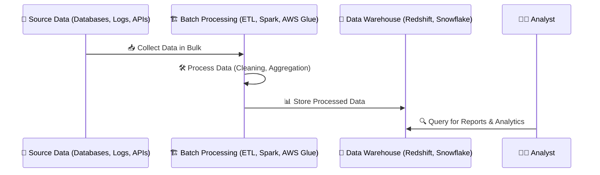
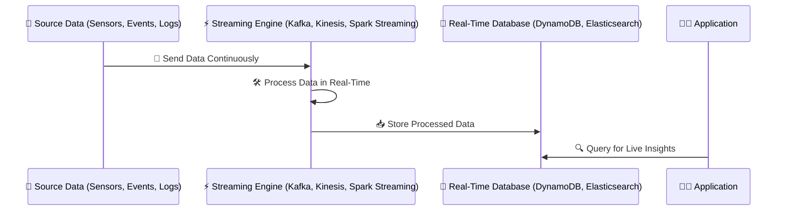

# **🔄 Batch Processing vs. Real-Time Streaming – Key Differences**

## **🔍 Introduction**

Data processing happens in two main ways:

- **Batch Processing** → Processes large volumes of data at scheduled intervals.
- **Real-Time Streaming** → Processes continuous data as it arrives, in real-time.

Each method has **different use cases, advantages, and trade-offs**, depending on **latency, scalability, and complexity**.

---

## **1️⃣ What is Batch Processing? 🏗️**

Batch processing **collects data over a period of time**, processes it in bulk, and stores the results.

### **📌 How Batch Processing Works (Step-by-Step)**

- 1️⃣ **Extract Data** → Data is collected from multiple sources (databases, logs, APIs).
- 2️⃣ **Process Data in Bulk** → Data is transformed, aggregated, and cleaned in batches.
- 3️⃣ **Store Processed Data** → The results are stored in a **data warehouse or a database** for analysis.



### **✅ Pros & Cons of Batch Processing**

| Feature              | ✅ Pros                                 | ❌ Cons                                            |
| -------------------- | --------------------------------------- | -------------------------------------------------- |
| **Best for**         | Large data volumes, periodic processing | Not ideal for real-time needs                      |
| **Processing Speed** | Efficient for large-scale data          | Latency (delays between data arrival & processing) |
| **Storage Cost**     | Lower (data processed in bulk)          | Requires storage for unprocessed data              |
| **Common Tools**     | Apache Spark, AWS Glue, Google Dataflow | Not suitable for real-time applications            |

📌 **Example Use Case:**  
A **banking system** processes **daily transactions** at midnight to generate **end-of-day financial reports**.

### **📚 References to Learn More**

- 🔹 **AWS Glue for Batch Processing** – [link](https://docs.aws.amazon.com/glue/latest/dg/what-is-glue.html)
- 🔹 **Apache Spark Batch Processing** – [link](https://spark.apache.org/docs/latest/sql-programming-guide.html)

---

## **2️⃣ What is Real-Time Streaming? ⚡**

Real-time streaming processes data **continuously** as it arrives, enabling instant decision-making.

### **📌 How Real-Time Streaming Works (Step-by-Step)**

- 1️⃣ **Capture Data Streams** → Events from logs, IoT devices, APIs are ingested.
- 2️⃣ **Process in Real-Time** → Data is filtered, transformed, and enriched as it flows.
- 3️⃣ **Store Processed Data** → Data is written to a **database or analytics system** immediately.



### **✅ Pros & Cons of Real-Time Streaming**

| Feature              | ✅ Pros                                    | ❌ Cons                             |
| -------------------- | ------------------------------------------ | ----------------------------------- |
| **Best for**         | Low-latency, real-time analytics           | Higher infrastructure costs         |
| **Processing Speed** | Instant (real-time)                        | More complex to implement           |
| **Storage Cost**     | Minimal (processed as it arrives)          | Requires powerful compute resources |
| **Common Tools**     | Apache Kafka, AWS Kinesis, Spark Streaming | Harder to debug & maintain          |

📌 **Example Use Case:**  
A **ride-sharing app** (like Uber) **tracks drivers' locations in real-time** and updates the system **instantly**.

### **📚 References to Learn More**

- 🔹 **AWS Kinesis Streaming Guide** – [link](https://docs.aws.amazon.com/kinesis/latest/dev/what-is-kinesis.html)
- 🔹 **Apache Kafka Real-Time Processing** – [link](https://kafka.apache.org/documentation/)

---

## **3️⃣ Key Differences: Batch vs. Streaming**

| Feature             | Batch Processing 🏗️                    | Real-Time Streaming ⚡                     |
| ------------------- | -------------------------------------- | ------------------------------------------ |
| **Data Processing** | Bulk, scheduled jobs                   | Continuous, real-time                      |
| **Latency**         | Minutes to hours                       | Milliseconds to seconds                    |
| **Use Case**        | BI reports, ETL, end-of-day processing | Live dashboards, fraud detection, IoT data |
| **Storage**         | Data stored first, then processed      | Processed as it arrives, then stored       |
| **Scalability**     | Efficient for big data                 | Needs auto-scaling for traffic spikes      |

---

## **4️⃣ When to Use Batch Processing vs. Real-Time Streaming?**

| **Scenario**                                   | **Best Approach**      |
| ---------------------------------------------- | ---------------------- |
| Generating **daily reports & summaries**       | ✅ Batch Processing    |
| **Fraud detection in banking transactions**    | ✅ Real-Time Streaming |
| **Processing social media comments & trends**  | ✅ Real-Time Streaming |
| **Aggregating sales data for monthly reports** | ✅ Batch Processing    |
| **Monitoring IoT sensor data**                 | ✅ Real-Time Streaming |

---

## **5️⃣ How Do Batch & Streaming Work Together?**

Most modern **data pipelines combine both** batch and streaming:

- **Batch processing for structured historical reports.**
- **Streaming for real-time insights & event-driven applications.**

```mermaid
graph TD;
    A[Source Data (APIs, Logs, Sensors)] -->|Extract| B[Real-Time Stream Processing (Kafka, Kinesis)];
    B -->|Live Data| C[Streaming Storage (Elasticsearch, DynamoDB)];
    A -->|Extract in Batches| D[Batch Processing (AWS Glue, Spark)];
    D -->|Store Processed Data| E[Data Warehouse (Redshift, Snowflake)];
    C -->|Live Insights| F[Real-Time Applications];
    E -->|Historical Analysis| G[BI & Reports];
```

📌 **How this works:**

- 1️⃣ **Streaming Engine (Kafka, Kinesis) processes live data** → Real-time data is stored in **Elasticsearch, DynamoDB**.
- 2️⃣ **Batch Processing (AWS Glue, Spark) cleans & transforms structured data** for **data warehouses**.
- 3️⃣ **Real-time apps** query **live data**, while **BI teams** analyze **historical data** from the warehouse.

---

## **🎯 Summary**

- ✔ **Batch Processing (ETL, AWS Glue, Spark)** → Best for **large-scale scheduled jobs & historical reporting**.
- ✔ **Real-Time Streaming (Kafka, Kinesis, Spark Streaming)** → Best for **instant insights, event-driven apps & AI predictions**.
- ✔ **Most systems combine both** → **Real-time analytics for live dashboards, batch for deep analysis**.
- ✔ **Cloud services like AWS Kinesis (streaming) & AWS Glue (batch) help automate processing**.

🚀 **Next Step:** Would you like to explore **Apache Kafka vs. AWS Kinesis for real-time streaming**, or move into **Big Data Processing with Spark**?
